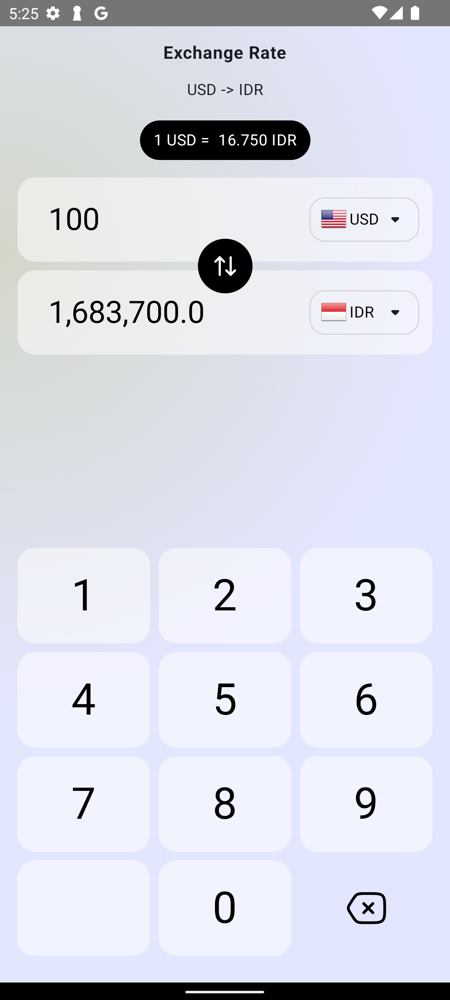

# Simple Exchange Rate App

A minimal Android app built with **Kotlin** and **Jetpack Compose** that displays currency exchange rates. This version uses **hardcoded exchange rates** and is designed for learning or prototyping purposes.

## Features

- Built using Jetpack Compose for a modern UI
- Simple and clean design
- Hardcoded exchange rate logic (e.g., USD to IDR, EUR to USD, etc.)
- Lightweight and fast
- Great starting point for learning Compose and Kotlin

## Screenshots



## Tech Stack

- [Kotlin](https://kotlinlang.org/)
- [Jetpack Compose](https://developer.android.com/jetpack/compose)
- Android SDK

## Getting Started

### Prerequisites

- Android Studio Hedgehog or later
- Kotlin 1.9+
- Minimum SDK 21+

### How to Run

1. Clone this repository:
   ```bash
   git clone https://github.com/fuadreza/ExchangeRate.git
2. Open the project in Android Studio.
3. Run the app on an emulator or physical device.